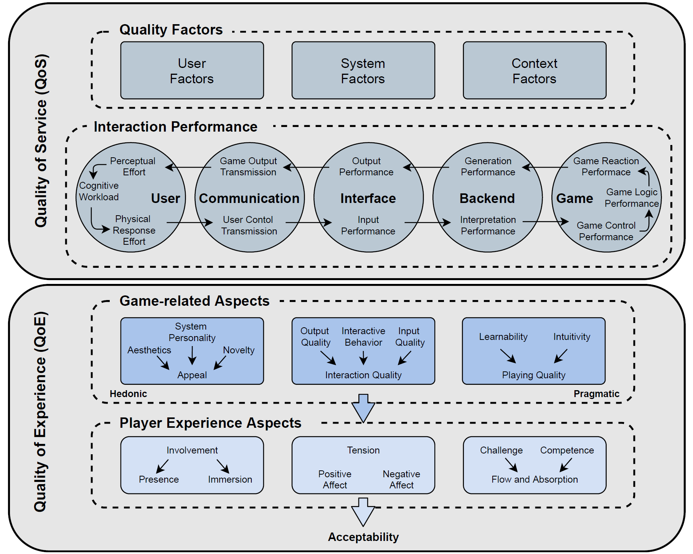

# Structural-Equation-Modeling-SEM
  
This project is expedted to evaluate and investigate the video gaming quality of experience for the cloud gaming taxonomy. In this context we use the gaming taxonomy dataset and start creating SEM models for some driven theories from the cloud gaming quality of experience taxonomy which is depicted in the below figure based on [[1]](http://statwiki.gaskination.com/index.php?title=Causal_Models).
Quality of Experience is splitted into gaming-related aspects and player experience aspects, where the game-related aspects are categorized into aesthetic aspects, interaction quality aspects, as well as playing quality aspects and player experience aspect consists of the sub-aspects challenge, control, flow, tension, immersion, competence, positive affect, and negative affect.
Therefore gaming taxonomy dataset contains ratings of various concepts such as input quality, video quality, and player experience features such as immersion, flow, and others and is a good candidate for our sem model analysis.

